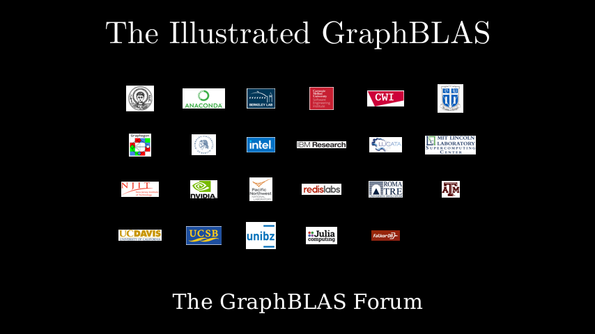

# Introduction

**[Interactive Notebook](../notebooks/00_introduction.ipynb)**

## Summary

This chapter introduces GraphBLAS and the foundations of algebraic graph processing:

- **What is GraphBLAS** - A sparse linear algebra API for expressing graph algorithms as matrix operations, enabling high-performance computation on CPUs and GPUs
- **Sparse Matrices** - Understanding sparse data structures that store only non-zero elements, avoiding wasteful computation with zeros
- **Adjacency Matrices** - How graphs are represented as matrices, where non-zero entries correspond to weighted edges between nodes
- **Matrix-Vector Multiplication** - The core operation for graph traversal, showing how multiplying a vector by an adjacency matrix discovers neighboring nodes
- **Dense vs Sparse Efficiency** - Why sparse algorithms dramatically outperform dense operations on real-world graph data
- **Applications** - Overview of graph applications across scientific domains including structural analysis, optimization, quantum chemistry, and economic planning
