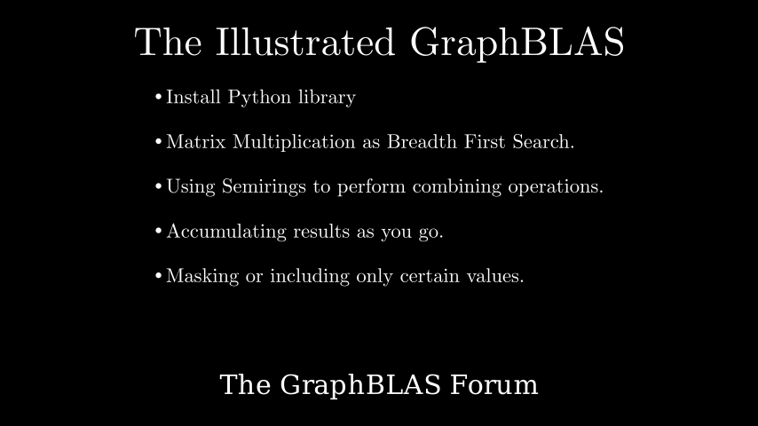

# Python GraphBLAS

**[Interactive Notebook](../notebooks/01_python_graphblas.ipynb)**

## Summary

This chapter covers installing and using GraphBLAS libraries with practical examples:

- **Installation** - Installing Python-GraphBLAS via pip, with SuiteSparse as the underlying implementation
- **Language Bindings** - Overview of GraphBLAS bindings for Python, Julia, and PostgreSQL
- **COO Format** - Creating sparse vectors and matrices using coordinate (COO) format with indices and values arrays
- **Sparse Representation** - Understanding why zeros are not stored in sparse data structures
- **Matrix-Vector Multiplication** - Using the `mxv` operation and `@` operator shorthand for graph traversal
- **GraphBLAS Assignment** - The `<<` operator for writing results back to vectors and matrices
- **Breadth-First Search** - Implementing BFS as repeated matrix-vector multiplication, discovering frontier neighbors through linear algebra
