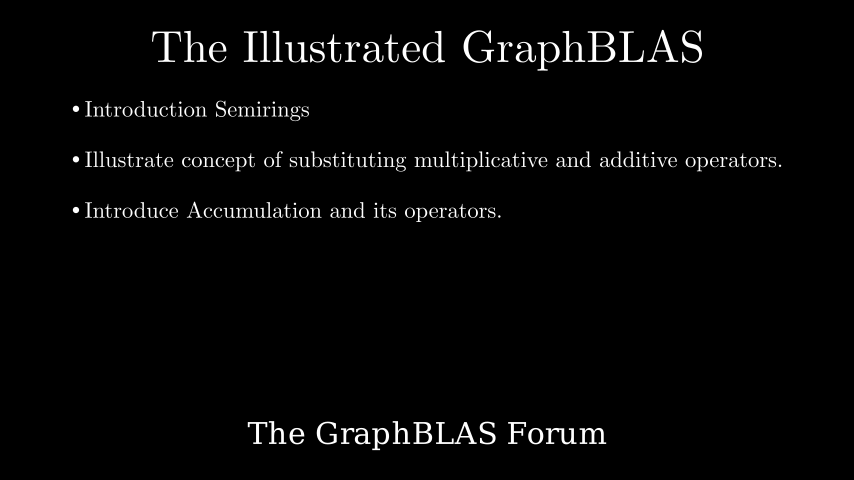

# Masking and BFS

**[Interactive Notebook](https://github.com/GraphBLAS/IllustratedGraphBLAS/blob/main/notebooks/03_masking_bfs.ipynb)**

## Summary

This chapter builds a complete Breadth-First Search implementation using GraphBLAS primitives:

- **Vector-Matrix Multiply** - Deep dive into `vxm` as the core operation for discovering graph neighbors using ANY_PAIR semiring
- **Structural Masks** - Selecting output positions based on where a mask has values
- **Value Masks** - Selecting output positions where mask values are True
- **Complement Masks** - Using `~` to invert selection, keeping only positions where the mask has no values
- **Masked Expansion** - Combining `vxm` with complement masking to prevent revisiting nodes in a single operation
- **Replacement Semantics** - The difference between merge mode (preserving existing values) and replace mode (clearing before writing)
- **BFS Algorithm Construction** - Step-by-step refinement from basic expansion to complete BFS with masking and replacement
- **Algorithm Trace** - Full walkthrough on a six-node graph showing vector and graph state at each iteration
- **Generalization** - How the same pattern applies to SSSP, connected components, PageRank, and triangle counting
