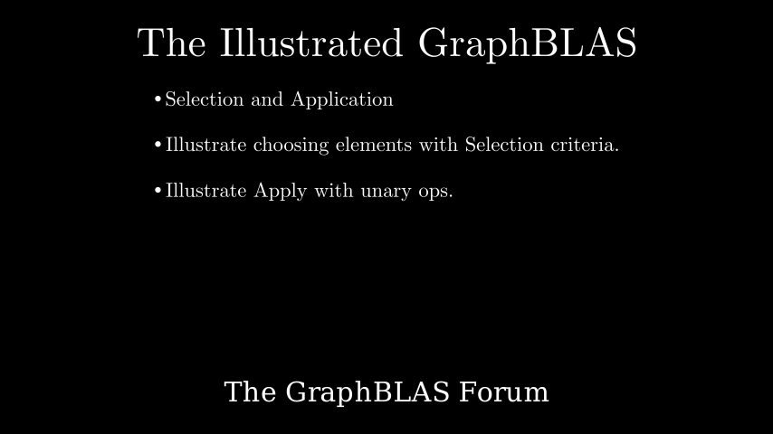

# Element-wise Operations and Transformations

**[Interactive Notebook](../notebooks/06_elementwise_ops.ipynb)**

## Summary

This chapter covers element-wise operations and matrix transformations in GraphBLAS:

- **Element-wise Addition** - Combining matrices by adding values at matching positions, useful for computing graph unions
- **Element-wise Multiplication** - The Hadamard product, multiplying matrices element by element to find graph intersections
- **Graph Union and Intersection** - Using element-wise operations to combine or filter graph structures
- **Selection Operations** - Choosing elements based on criteria such as thresholds, comparisons, or patterns
- **Apply Operations** - Transforming matrix elements by applying a function uniformly across the entire matrix
- **Filtering Graphs** - Removing edges that don't meet certain criteria
- **Value Transformation** - Scaling, normalizing, or otherwise modifying edge weights
- **Practical Applications** - Graph comparison, filtering by edge weight, normalizing adjacency matrices
