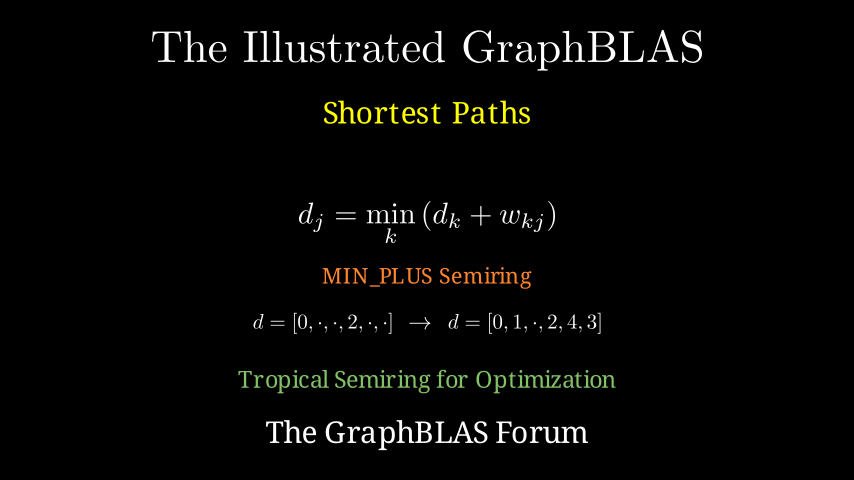

# Shortest Path

**[Interactive Notebook](../notebooks/07_shortest_path.ipynb)**

## Summary

This chapter presents an elegant algebraic solution to shortest path problems:

- **Tropical Semiring** - The MIN_PLUS semiring, widely used in optimization problems across engineering and science
- **Single Source Shortest Path** - Finding minimum distances from one node to all others
- **All-Pairs Shortest Path** - Extending to find shortest paths between all node pairs
- **Algorithm Convergence** - Understanding when the iterative process reaches the optimal solution
- **Practical Applications** - Navigation, network routing, logistics, and resource optimization
