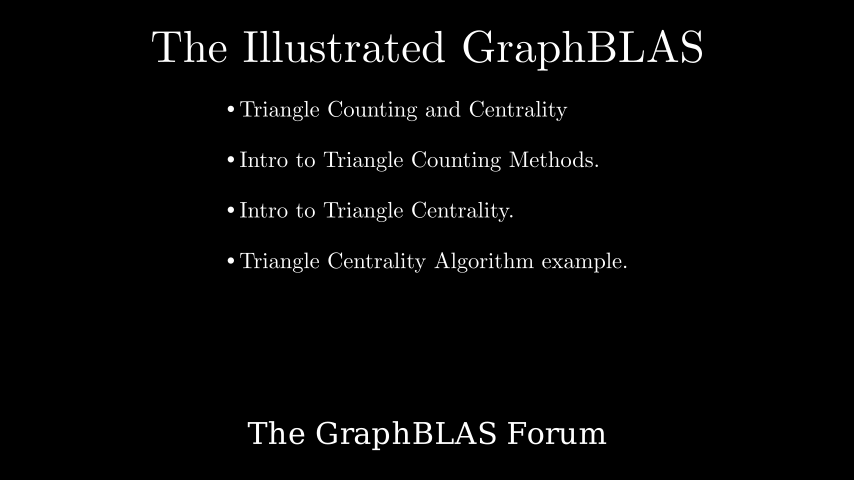

# Triangle Counting and Centrality

**[Interactive Notebook](../notebooks/08_triangles_centrality.ipynb)**

## Summary

This chapter explores triangle structures and node importance in graphs:

- **Triangles in Graphs** - Three mutually connected nodes forming the fundamental building block for graph analysis
- **Algebraic Triangle Counting** - Using matrix operations (A² ⊙ A) to efficiently count triangles
- **Triangle Counting Algorithms** - Different approaches with various performance characteristics
- **Centrality Measures** - Ranking node importance based on structural position in the graph
- **Triangle-based Centrality** - Determining node importance by counting triangles around each node
- **Applications** - Social network analysis, community detection, and graph clustering
