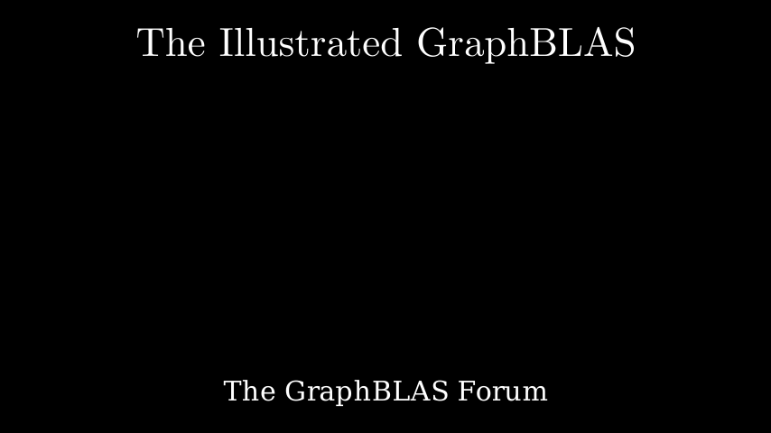

# Sparse Neural Networks

**[Interactive Notebook](https://github.com/GraphBLAS/IllustratedGraphBLAS/blob/main/notebooks/09_sparse_neural_nets.ipynb)**

## Summary

This chapter demonstrates how GraphBLAS enables sparse neural network computation:

- **Neural Network Fundamentals** - The building blocks of machine learning and AI systems
- **Dense vs Sparse Networks** - How sparse representations overcome memory limitations of dense neural networks
- **Sparse Matrix Representation** - Encoding neural network weights as sparse matrices
- **Inference with GraphBLAS** - Performing forward propagation using sparse matrix-vector multiplication
- **Activation Functions** - Applying non-linear transformations using GraphBLAS apply operations
- **Scalability** - Building larger networks than possible with dense approaches
